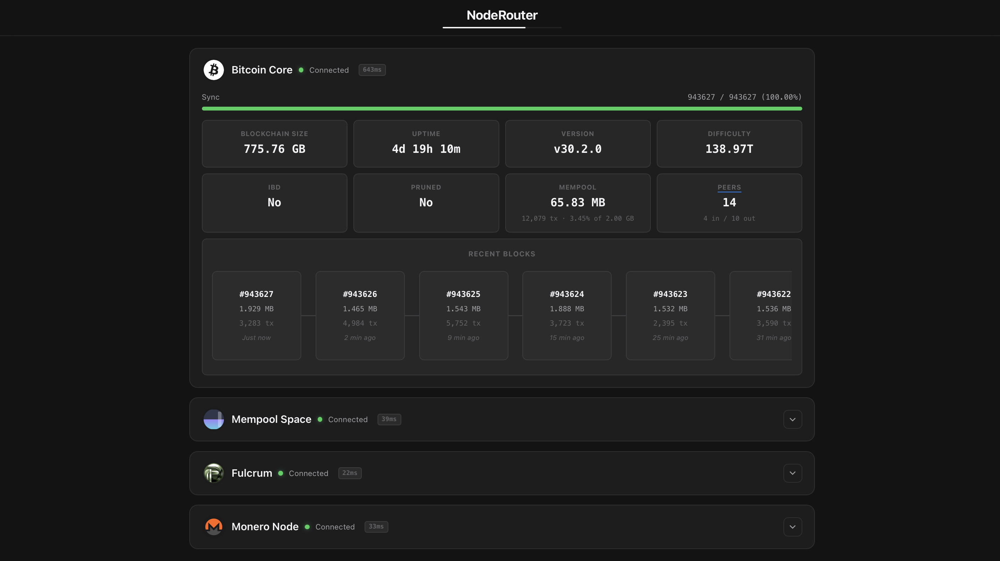
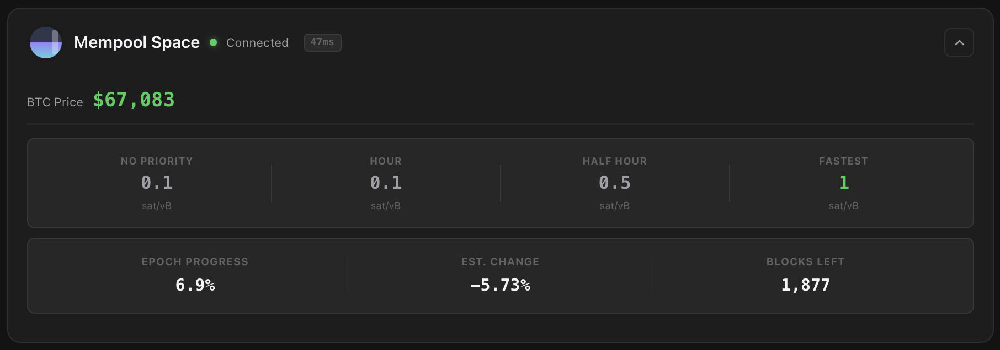
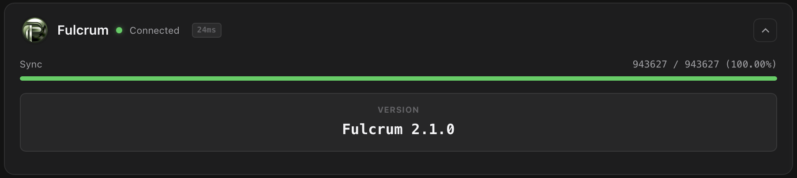
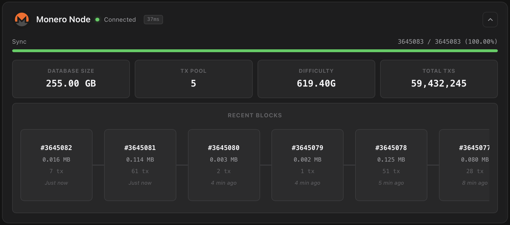
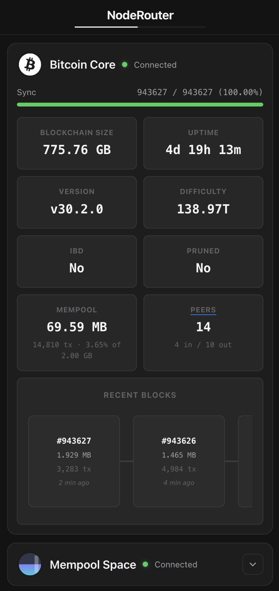

# NodeRouter

> A fiercely minimal, hyper-efficient, single-page dashboard for self-hosted Bitcoin & crypto nodes.

**Built with Go** — Single static binary, **3 Go dependencies, 0 NPM dependencies**, ~15MB. Starts in <100ms.

---

## Table of Contents

- [Overview](#overview)
- [Screenshots](#screenshots)
- [Supported Modules](#supported-modules)
- [Quick Start](#quick-start)
- [Documentation](#documentation)
- [License](#license)

---

## Overview

NodeRouter is a unified monitoring dashboard for self-hosted Bitcoin and Monero nodes. It connects to your Bitcoin Core, Mempool Space, Fulcrum Electrum Server, and Monero nodes via their respective APIs, polling them at a configurable interval and presenting real-time telemetry in a beautiful, dark-themed single-page application.

**What it does:**

- **Bitcoin Core** — Displays sync progress, blockchain size, network difficulty, peer topology (with chart showing Clearnet/Tor/I2P distribution), mempool usage, and an interactive drag-to-scroll visualization of recent blocks.
- **Mempool Space** — Shows real-time fee estimates across multiple confirmation tiers, BTC price, and difficulty epoch progress with estimated change percentage.
- **Fulcrum** — Monitors Electrum server sync progress against Bitcoin Core's known headers, displaying version and sync status.
- **Monero** — Presents node sync status, network difficulty, total transactions since genesis, database size, transaction pool size, and a recent blocks visualization.

**How it works:**

The Go backend polls all enabled services concurrently on each refresh cycle. Block data is cached server-side to minimize RPC load — Bitcoin uses incremental fetching (only new blocks trigger RPC calls), while Monero fetches the full range efficiently via a single `get_block_headers_range` call. The server renders the initial HTML page with current data, then pushes JSON updates to all connected browsers via Server-Sent Events (SSE). The vanilla JavaScript client updates individual DOM elements in place — no page refresh needed.

**Key characteristics:**

- **Minimal** — Single Go file, zero JavaScript dependencies, no build step
- **Fast** — ~15MB binary, <100ms startup, instant DOM updates via cached element references
- **Read-only** — Never writes to your nodes
- **Hot-reload config** — Edit `config.yaml` without restarting
- **Multi-architecture** — Runs on amd64, arm64, and arm/v7 (Raspberry Pi)
- **Real-time updates** — SSE for instant data updates
- **Server-side rendering** — All HTML rendered on server, client only maintains SSE connection

---

## Screenshots

### Full Dashboard



<details>
<summary><strong>View Each section</strong></summary>

### Mempool Space



### Fulcrum



### Monero



### Mobile View



</details>

---

## Supported Modules

| Module | Protocol | Required? | Description |
|--------|----------|-----------|-------------|
| **Bitcoin Core** | JSON-RPC 1.0 | ✅ Yes | Sync status, peer topology, mempool, recent blocks |
| **Mempool Space** | REST API | Optional | Fee estimates, difficulty epoch, BTC price |
| **Fulcrum** | JSON-RPC 2.0 (TCP/SSL) | Optional | Electrum server status and sync progress |
| **Monero** | JSON-RPC 2.0 (HTTP) | Optional | Full node telemetry, recent blocks |

---

## Quick Start

```bash
# 1. Clone and configure
git clone https://github.com/byakugan-1/NodeRouter && cd NodeRouter

# 2. Download the sample config.yaml and customize
curl -O https://raw.githubusercontent.com/byakugan-1/NodeRouter/refs/heads/main/config.yaml

# 3. Build and run
docker compose up -d

# 4. Access dashboard
open http://localhost:5000
```

> 📖 **Full getting started guide:** [docs/getting-started.md](docs/getting-started.md)

---

## Documentation

### Getting Started

Comprehensive setup guide covering configuration, Docker deployment, networking options, and troubleshooting.

📄 **[Getting Started Guide](docs/getting-started.md)**

- [Installation](docs/getting-started.md#installation)
- [Configuration](docs/getting-started.md#configuration)
- [Docker Deployment](docs/getting-started.md#docker-deployment)
- [Networking Options](docs/getting-started.md#networking-options)
- [Environment Variables](docs/getting-started.md#environment-variables)
- [Troubleshooting](docs/getting-started.md#troubleshooting)

### Service Stats

Detailed documentation of every RPC/REST API call NodeRouter makes to each service, including sample requests, responses, and how the data is used.

📂 **[Service Stats Directory](docs/service-stats/)**

| Service | Documentation |
|---------|---------------|
| **Bitcoin Core** | [docs/service-stats/bitcoin-core.md](docs/service-stats/bitcoin-core.md) |
| **Mempool Space** | [docs/service-stats/mempool-space.md](docs/service-stats/mempool-space.md) |
| **Fulcrum** | [docs/service-stats/fulcrum.md](docs/service-stats/fulcrum.md) |
| **Monero** | [docs/service-stats/monero.md](docs/service-stats/monero.md) |

Each service document includes:
- Complete list of RPC/API calls made
- Sample curl commands with your node's address
- Sample JSON responses
- How NodeRouter uses each piece of data

---

## License

You are free to use, modify, and distribute this software as you wish. This project is released under the [MIT License](LICENSE).
